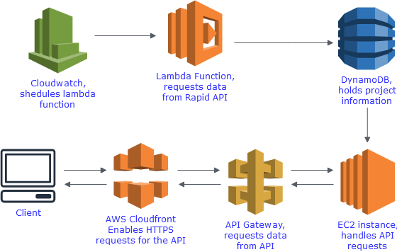

# Covid data API

This project is a project using Covid data from Rapid API to build a dashboard showing covid rates around Europe. This project is not yet complete, please note that the RestAPI works, currently building front end with React.

## Project Example

<!-- [Website](https://bradwebb101.com) -->
TBA - Front end not yet complete

## How is it built

### Front end 
- Still to complete

### Back end

- The back end is written in Python, using Flask for a RestAPI. Using DynamoDB as the DB.
- The RestAPI is hosted on a EC2 instance, on AWS cloud.

## Infrastructure



## Downloading and usage

### Back-end
Clone this repo 

``` git
git clone https://github.com/BradWebb101/Covid-data.git .
```
This project has 2 parts, data collection and flask RestAPI

To run the data collection code run the following code
```cmd 
cd data_collection
```

Install dependancies

``` pip
pip install -r requirments.txt
```

Run back end code

``` python
python back_end_code.py
```

To run the RestAPI locally, from the root directory
```cmd 
cd restful_api
```

Install dependancies

```pip
pip install -r requirements.txt
```

run flask
```python
python main.py
```

## Example code 

Example Flask end point

``` python 
class today(Resource):
    def get(self, country):
        dynamodb = boto3.client('dynamodb', 
        aws_access_key_id = os.getenv('AWS_ACCESS_KEY_ID'),
        aws_secret_access_key = os.getenv('AWS_SECRET_ACCESS_KEY'),
        region_name=os.getenv('AWS_DEFAULT_REGION'))
        response = dynamodb.get_item(
        TableName='covid_data',
        Key={
            'date': {'S':str(datetime.datetime.date(datetime.datetime.now()))},
            'country': {'S':str(country)}
        },
        AttributesToGet = ['country', 'date', 'todays_cases', 
                            'todays_death', 'confirmed', 'deaths', 
                            'cases_per_100k', 'deaths_per_100k']
    )
        return response['Item']

api.add_resource(today, '/today/<country>')
```